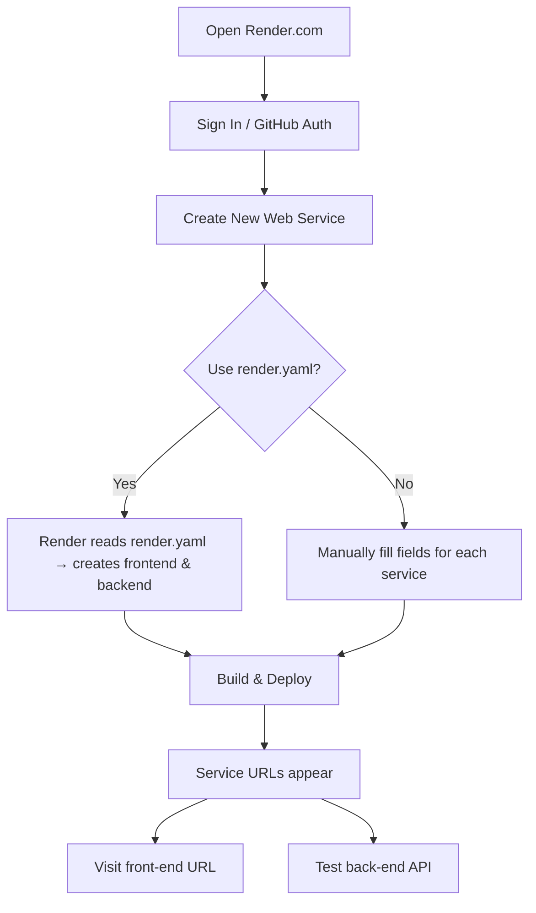

# Render Deployment Guide for ABROB Spark Forge

## 1️⃣ Sign‑up / log in to Render
1. Open **https://render.com** in your browser.
2. Click **“Sign Up”** (or **“Log In”** if you already have an account).
3. Choose **GitHub** authentication – this lets Render access your repos.

## 2️⃣ Connect your GitHub repository
1. After logging in you land on the Render dashboard.
2. Click **“New” → “Web Service”.**
3. In the **“Connect your repository”** step, select **GitHub** and grant access if prompted.
4. Find the repository **`Abdullahi1460/abrob-spark-forge`** and select it.
5. Keep the default branch **`main`** and click **“Next”.**

## 3️⃣ Deploy using the `render.yaml` wizard (recommended)
1. On the “Configure Service” screen, click **“From render.yaml”** at the bottom.
2. Render will read the `render.yaml` file at the repo root and automatically create two services:
   - **Frontend** (`abrob-frontend`) – Vite static site.
   - **Backend** (`abrob-backend`) – Node/Express API.
3. Verify the detected values:
   - **Build Command** – `npm install && npm run build` (frontend) / `npm install` (backend).
   - **Start Command** – `npx serve -s dist` (frontend) / `node backend/server.js` (backend).
   - **Root/Working Directory** – ensure **`rootDirectory: "."`** (backend) so Render looks for `backend/server.js` in the repository root.
4. Click **“Create Web Service”**. Render will start a build for each service.

## 4️⃣ (Alternative) Manual service creation (if you don’t want to use `render.yaml`)
### Front‑end service
- **Name:** `abrob-frontend`
- **Environment:** `Node`
- **Build Command:** `npm install && npm run build`
- **Start Command:** `npx serve -s dist`
- **Root Directory:** *(leave blank – project root)*

### Back‑end service
- **Name:** `abrob-backend`
- **Environment:** `Node`
- **Build Command:** `npm install`
- **Start Command:** `node backend/server.js`
- **Root Directory:** `.` (a single dot) – tells Render to start from the repo root.
- Click **“Create Web Service”** for each service.

## 5️⃣ Set environment variables (optional but common)
1. In the Render dashboard select a service → **“Environment”** tab.
2. Click **“Add Environment Variable”.**
3. Add the following (replace `<YOUR_FRONTEND_URL>` / `<YOUR_BACKEND_URL>` with the URLs Render gives you after the first deploy):
   - **Front‑end:**
     - `VITE_API_URL = https://<YOUR_FRONTEND_URL>`
     - `VITE_CONTACT_ENDPOINT = https://<YOUR_BACKEND_URL>/api/contact`
   - **Back‑end:**
     - `FRONTEND_URL = https://<YOUR_FRONTEND_URL>`
4. Save and **restart** the service so the variables take effect.

## 6️⃣ Verify the deployment
1. Open the **Logs** tab of each service – you should see a successful build and a line like `Server listening on port …` for the back‑end.
2. The **URL** for each service appears at the top of the service page:
   - Front‑end: `https://abrob-frontend.onrender.com`
   - Back‑end: `https://abrob-backend.onrender.com`
3. Visit the front‑end URL in a browser – you should see your ABROB site.
4. Test an API endpoint, e.g.:
   ```bash
   curl https://abrob-backend.onrender.com/api/health
   ```
   It should return JSON (or whatever your health‑check endpoint returns).

## 7️⃣ Automatic redeploys & updates
- Every push to the `main` branch automatically triggers a new build for **both** services.
- If you change environment variables, edit them in the dashboard and click **“Restart Service”.**

## 8️⃣ Common pitfalls & fixes
| Symptom | Cause | Fix |
|----------|-------|-----|
| `MODULE_NOT_FOUND: backend/server.js` | Render looked in a hidden `src` folder. | Ensure `rootDirectory: "."` (and optionally `workingDirectory: "."`) in `render.yaml` or set **Root Directory** to `.` when creating the service manually. |
| 502/503 errors after a deploy | Build succeeded but server didn’t start (e.g., missing `process.env.PORT`). | In `backend/server.js` listen on `process.env.PORT || 3000`. |
| Placeholder `<YOUR_FRONTEND_URL>` still shows in the app | You never replaced the placeholder with the real URL. | Copy the URLs from the Render dashboard, paste them into the env‑var values, save, and restart the services. |

---

### Quick diagram of the flow


---

You can now follow these steps directly in Render. Let me know if any part is unclear or if you hit any errors during the process.
